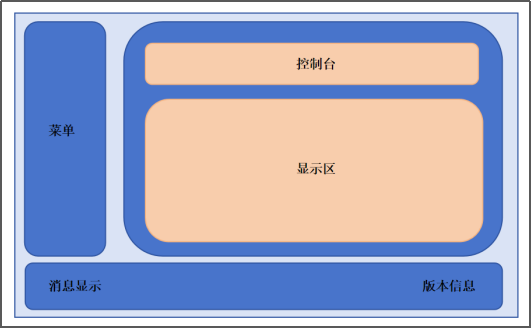

## 一 开发流程
### （一）初始化数据库
1. 新建数据库(默认连接密码为：lengkong#CMS1234)，运行命令如下：
> CREATE DATABASE IF NOT EXISTS `cms` CHARACTER SET utf8mb4 COLLATE utf8mb4_unicode_ci;
2. 新建表，运行backup/cms.sql。
### （二）开发管理端项目gui
1. 初始化项目

Gui程序采用tauri-solid-ts-tailwind-vite脚手架。从github下载后重命名为gui，然后参考readme进行相关工具和库的更新。

下载地址：https://github.com/AR10Dev/tauri-solid-ts-tailwind-vite 。

2. 布局

在src\App.tsx中通过tailwindcss完成整体布局。

3. 开发进度
- 2月17日：完成全局消息。完成生命周期。完成前端solid里调用后端rust代码的测试。