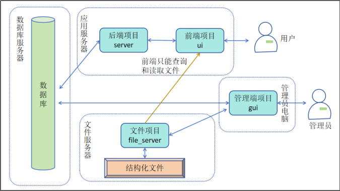

<h1 align="center" style="margin: 30px 0 30px; font-weight: bold;">冷空CMS</h1>
<h4 align="center">设计为在低配服务器上运行的轻量化CMS系统</h4>

## 一 设计与思路
### （一）思路
低配服务器的特点是CPU计算能力差、存储空间少、网络带宽小。通过以下几个方法降低资源消耗：

- 核心服务仅保留基本的查询和查看操作，将增加、删除、修改等操作转移到管理员电脑上。前端与后端进行分离，不能采用服务端渲染技术，应将界面的渲染转移到用户电脑上。
- 内容不要存放到数据库中，应将内容结构化为单独的文件，并存储到单独的文件存储空间中。渲染页面时，前端直接从文件存储空间中获取内容，不经过应用服务器。
- 可以配合DNS系统的静态资源缓存技术，进一步降低网络带宽的消耗。
### （二）总体架构图

项目共分为4个子项目：
- **后端项目server**：提供数据库查询和业务逻辑的实现。技术选型为go语言和goframe框架。
- **前端项目ui**：展示给用户的界面。技术选型为solidjs和tailwindcss。
- **文件服务器项目file_server**：提供文件的存储和读取服务。技术选型为go语言和goframe框架。该子项目非必需，可以直接采用现有的文件存储系统或商业化的存储服务。
- **管理端项目gui**：提供给管理员使用的桌面应用。拥有对数据库和文件存储的完全控制权限。技术选型为tauri-solid-ts-tailwind-vite。
## 二 开发流程
详见[开发手册](docs/dev.md)